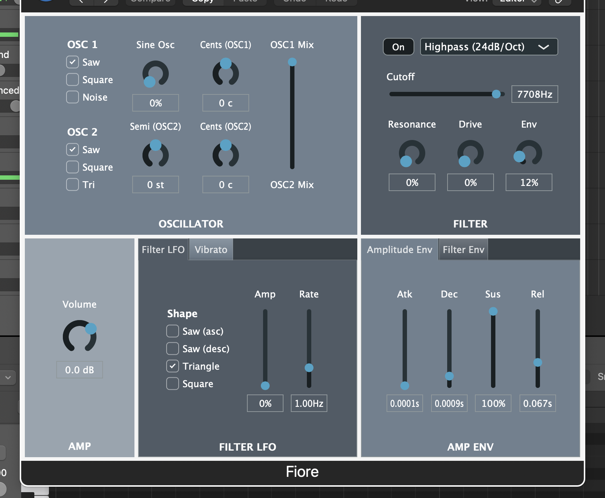

# Fiore

### Overview 🎹
Fiore is a synthesizer plugin built with [JUCE](https://juce.com). Its layout and feature set were inspired by Logic Pro's Retro Synth. It's a simple subtractive synth containing the following features:

- Two **oscillators** with selectable waveforms and detuning capability for OSC2
- A **filter** (lowpass, bandpass, or highpass) with adjutable resonance and drive
- ADSR **envelopes** for amplitude and filter cutoff
- Two **LFOs** for filter cutoff modulation and vibrato, respectively
- 16-voice polyphony

I built this synth as a senior capstone project for my degree in Computer Science & Music at UIUC. 🎓

### Installation 🎛️

**Download: [VST3 or AU](https://drive.google.com/drive/folders/13Lbz1v___eVtjWiPUFKlm65ORKPyT9KW?usp=sharing)**

If you're on MacOS, you'll need to put the `.component` or `.vst3` file into your `Library/Audio/Plug-Ins/Components` or `Library/Audio/Plug-Ins/VST3` folder. I'm not sure about installation on Windows.

To build and run the synth from it's source code:
1. [Download JUCE](https://juce.com/get-juce/)
2. Clone or download the code from this repository
3. Open `Fiore.jucer` in the Projucer
4. Open and build the project in Xcode or Visual Studio
5. There should now be a new plugin in your system's VST/AU folder that you can run in a DAW or JUCE's AudioPluginHost.
